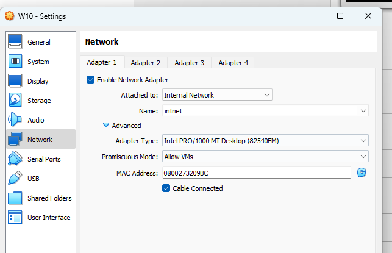

# Wireshark
## Configura o interfaz de rede en modo promíscuo e arráncao
Interfaz

## Executa un ping único dende debian server con destino ao W10. Analiza as peticións ICMP e comproba, mediante capturas, que tanto as MAC como as IP de orixe e destino son correctas
Ping debian-windows

Ping debian-ubuntu

Mac debian

Mac ubuntu

## Se fas un ping entre os dous linux, tamén o captura?
## Conectate a unha páxina HTTP con form para atopar os datos dun form dende Wireshark