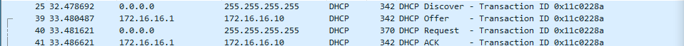

# DHCP
### Instala un servidor DHCP nun Debian Server

Configuracion ip server:

Status de dhcp al instalar:

### Monta unha infraestuctura na rede 172.16.X.0/24
- Rango entre 10 e 20
- ip server X.X.X.1
- gateway X.X.X.100
- dns X.X.X.254
- dominio si.local

Configuracion interfaz dhcp:

Configuracion dhcp:

Nuevo status de dhcp:

### Utiliza Wireshark para capturar a asignar DHCP

Desde windows, al hacer un renew:

Se capturan los paquetes desde wireshark:

## Crea reservas MAC para:
- Windows: X.X.X.15
- Ubuntu: X.X.X.17

Ip reservadas:

Windows ipconfig:

Ubuntu ip a

