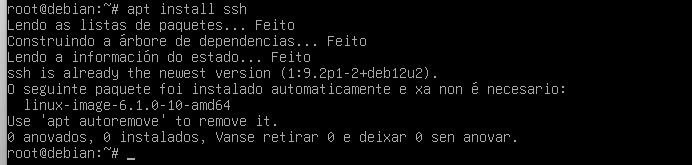
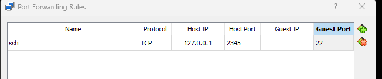
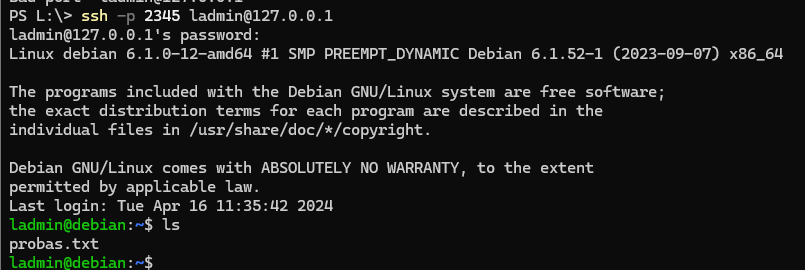
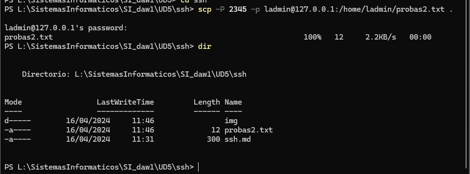
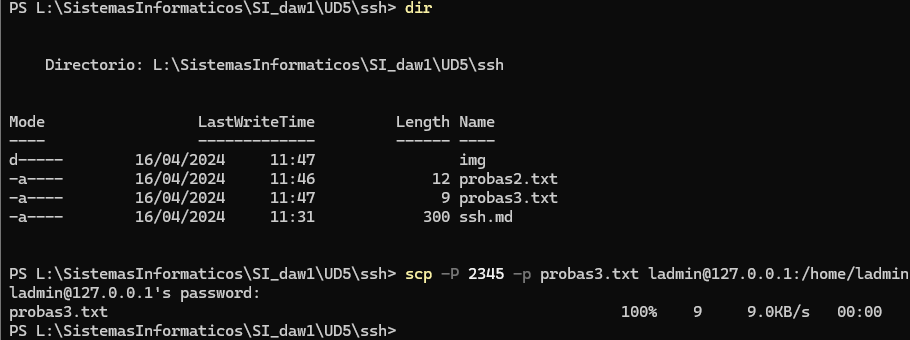
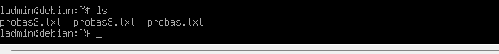

# SSH - Oscar Carballo Puebla
### Instala SSH en un Debian Server.

Instalamos ssh

### Realiza un mapeo de puertos al SSH con el puerto 2345 de la máquina real.

Realizamos el mapeo

### Haz una conexión SSH desde la máquina real a la máquina virtual.

Nos conectamos al servidor

### Descarga un fichero desde el servidor.

Descargamos un fichero

### Sube un archivo al servidor.

Subimos un fichero

Comprobamos que se ha subido

