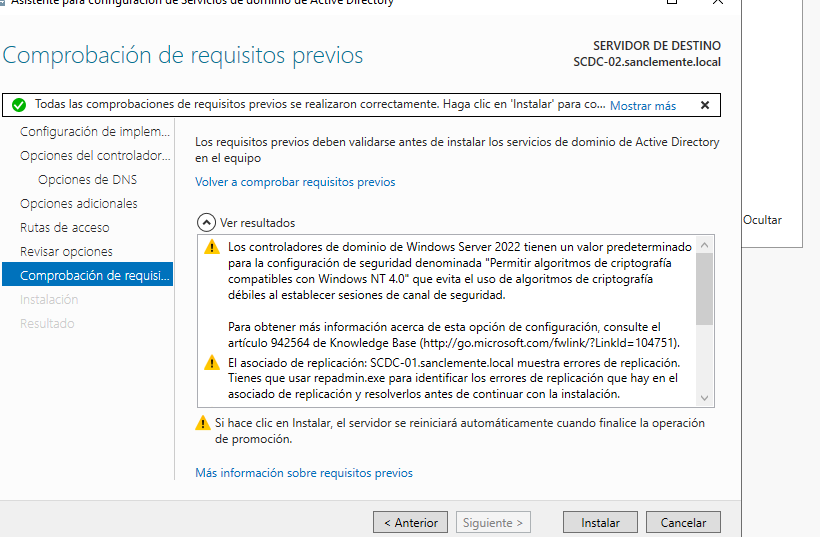

# DC2 - Oscar Carballo Puebla

## Configuramos la nueva clonación

## Comprobamos los cambios

## Unimos la máquina al dominio e iniciamos sesión como administrador

## Instalamos active dreictory y promovemos para que sea DC

## Configuramos DHCP para que funcione fronte a caídas.

Cambiamos el dns de SCDC-01

## Apagamos DC1 y comprobamos que los usuarios funcionan bienç

