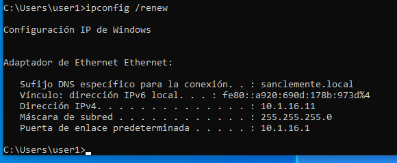
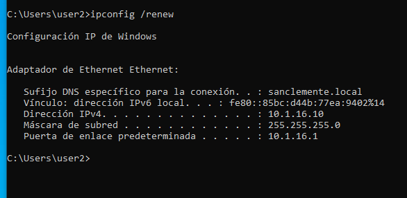
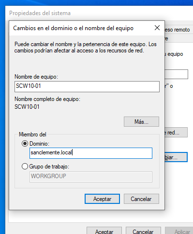
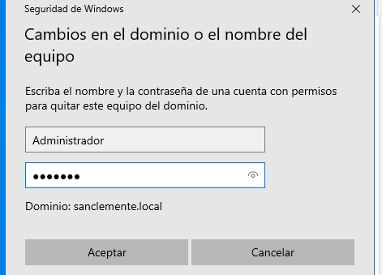
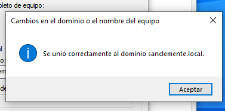
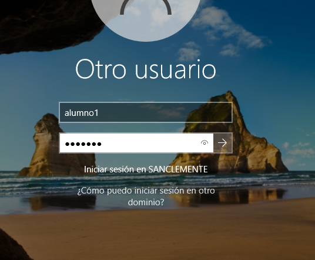
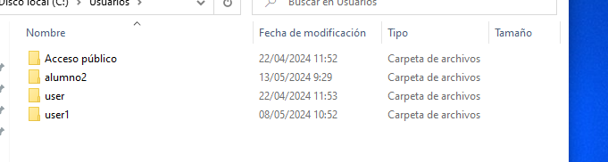
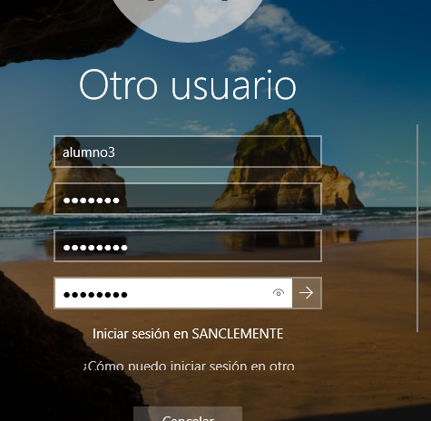
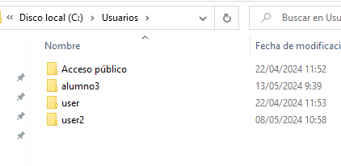
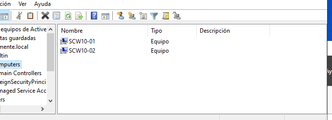

# Equipos - Oscar Carballo Puebla

## Cambia o nome dos cliente

## Instala un servidor DHCP

## Fai reservas de mac

## Engade o equipo 1 ao dominio coa interfaz

Indicamos el dominio

Ponemos la contraseña

Unido correctamente

## Engade o equipo 2 ao dominio coa powershell

Añadimos

Ponemos la contraseña

## Inicia sesión e mostrar a estructura

testEquipo 1

testEquipo 2

Equipos en el dominio

