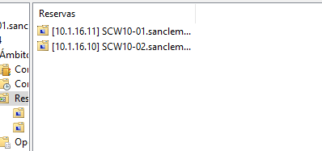

# Equipos - Oscar Carballo Puebla

## Cambia o nome dos cliente

## Instala un servidor DHCP

## Fai reservas de mac

![Concesion1]

![Concesion2]

## Engade o equipo 1 ao dominio coa interfaz

## Engade o equipo 2 ao dominio coa powershell

## Inicia sesión e mostrar a estructura

