# GPO - Oscar Carballo Puebla

## Bloc de notas como atajo

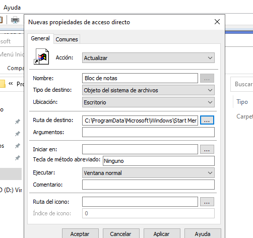

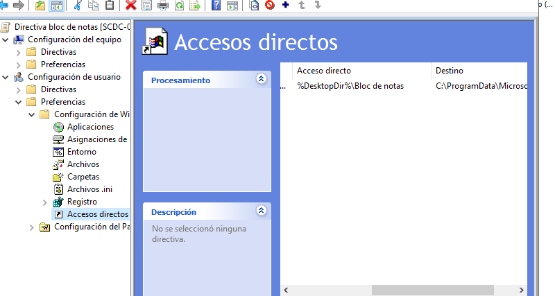

Comprobamos que funcione 

## Bloquear acceso a C:

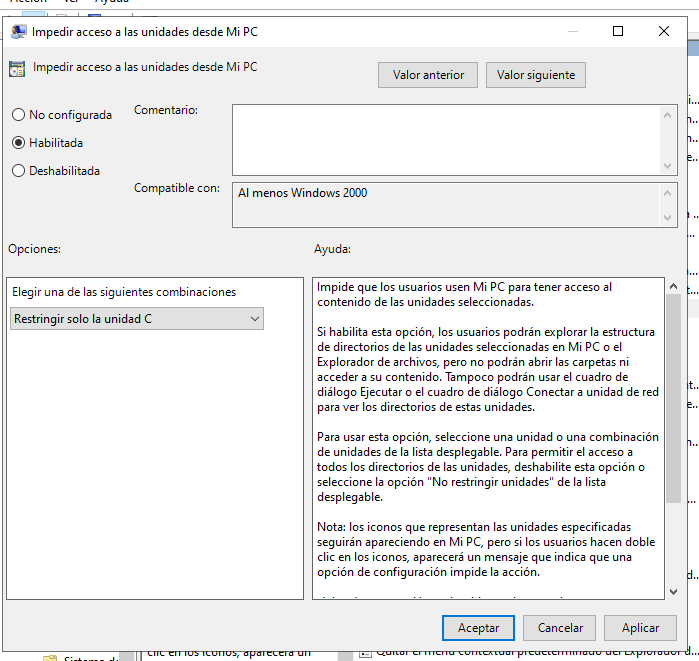

Lo apliamos a usuarios

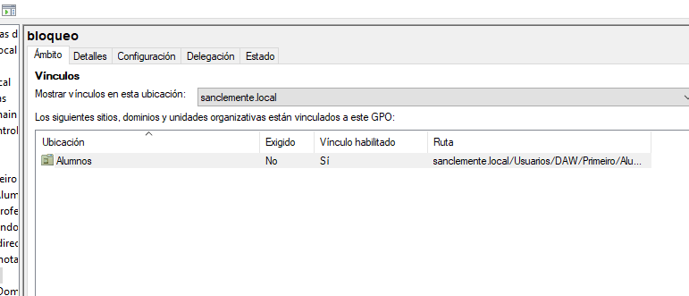

Comprobamos 

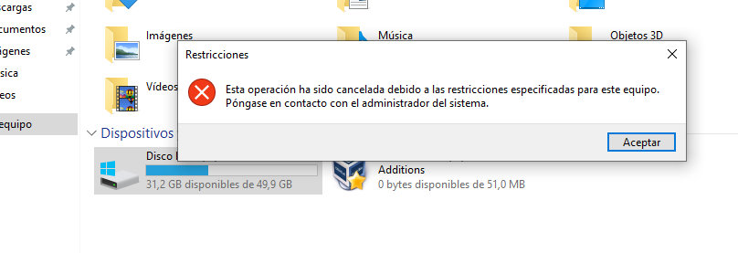

## Bloquear panel de control

Asignamos a usuario

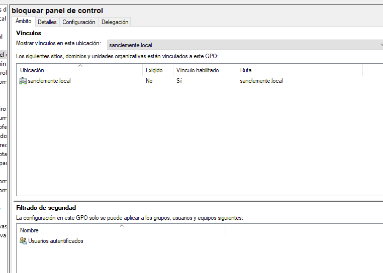

Bloqueamos panel de control

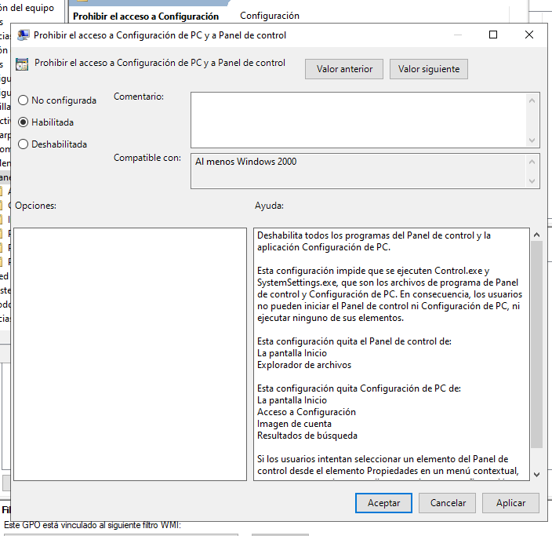

Comprobamos con usuario

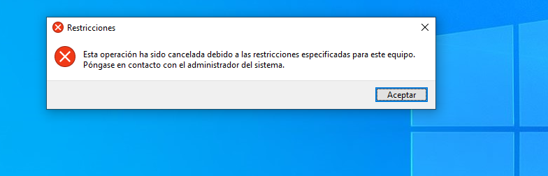

Comprobamos con administrador

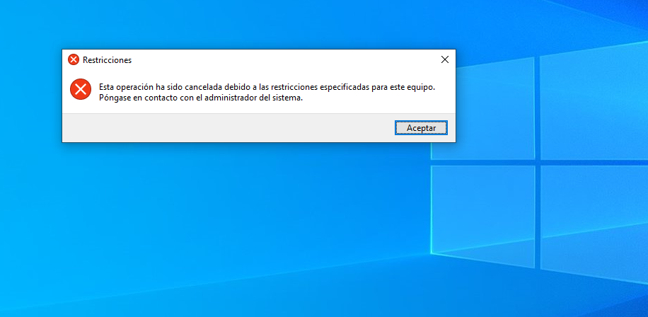

En administrador tambien nos bloquea, ya que seguimos siendo un usuario del dominio

## Actualizacion automática

Tiempo de actualizacion

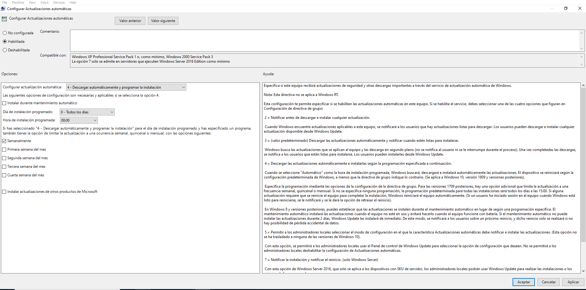

Servidor WSUS

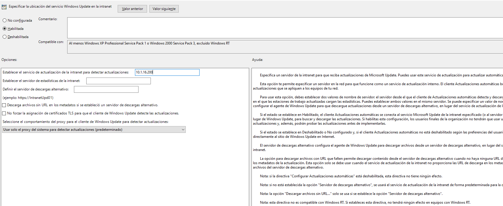

Comprobamos

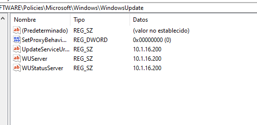

## Añadimos dos GPOs diferentes

Bloqueo pantalla

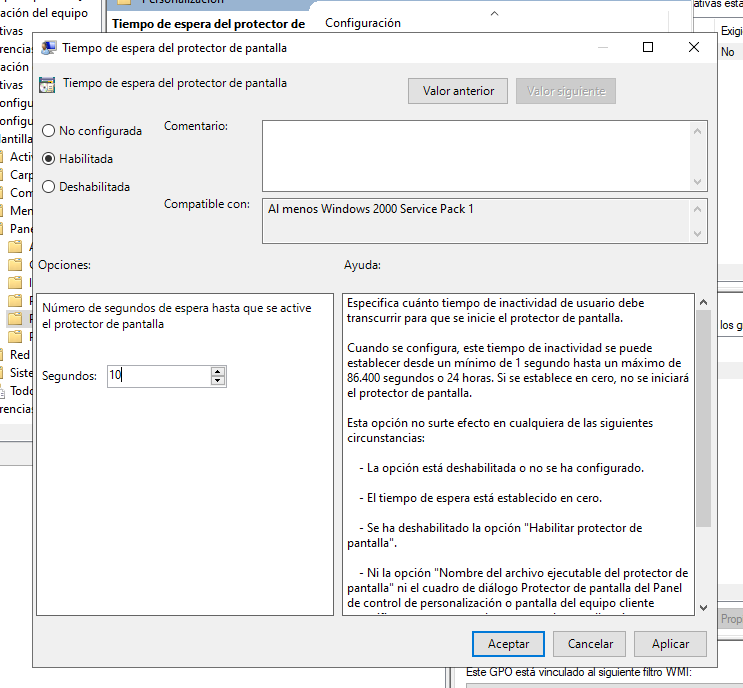

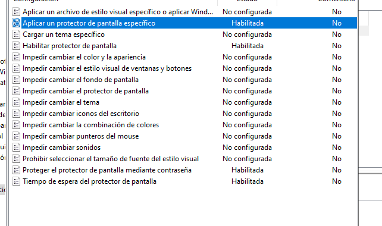

La pantalla se bloquea automaticamente tras 10 segundos

Mensaje en inicio de sesión

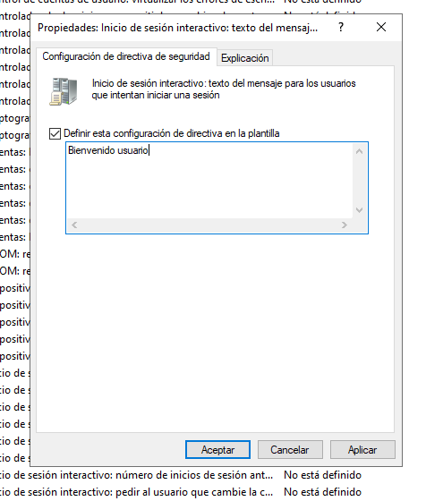

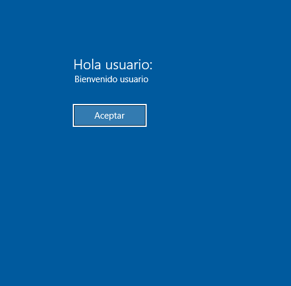

## Elimina todas las GPO

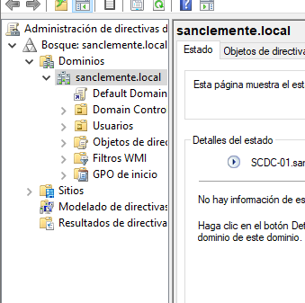