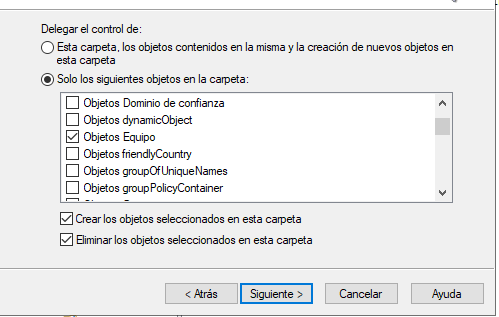

# Delegacions - Oscar Carballo Puebla

## Crea unha delegación para que G-Profes poidan xestionar as contrasinais dos alumnos

## Instala RSAT nun cliente

## Entra no CD con un usuario

## Comproba que a delegación funciona

Acción sin permiso

Acción con permiso

## Crea unha delegación personalizada na que Gerardo poida xestionar Equipos sobre calquer OU onde haxa usuarios.

## Proba outras delegacións de profesores sobre alumnos

Usuarios

Grupos

