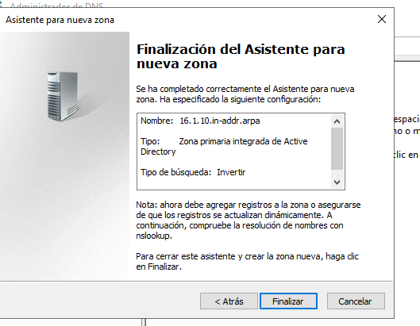
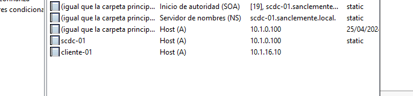
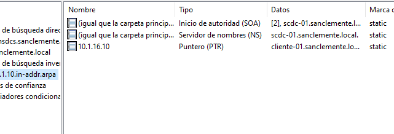
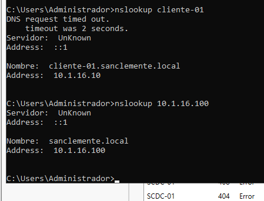

# DNS - Oscar Carballo Puebla

## Creamos unha zona inversa

Zona inversa

## Creamos un cliente de probas

Cremos cliente

Inversa

## Probamos a reslución inversa e directa

Comprobamos con nslookup

