# Infraestutura de rede - Oscar Carballo Puebla

## Creación de W2022 Server e W10 "tuneados"

W10

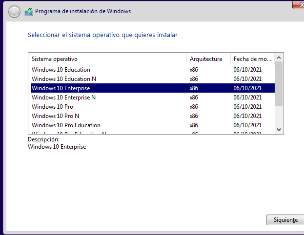
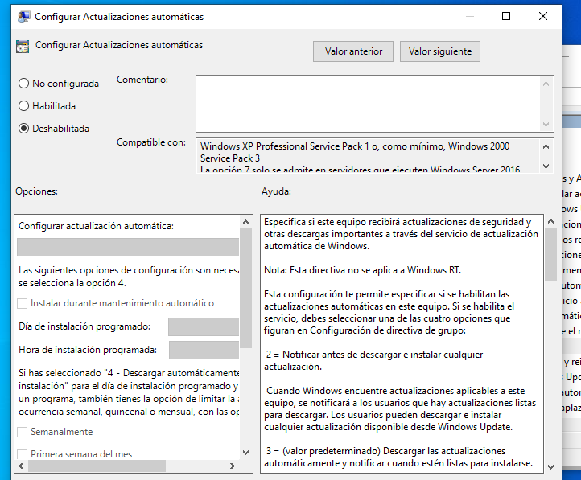
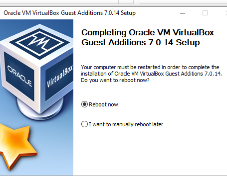

W2022

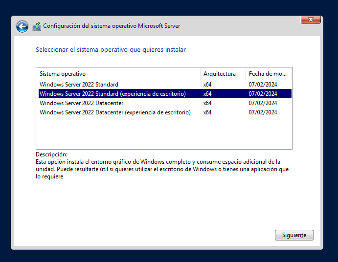
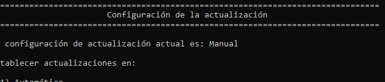
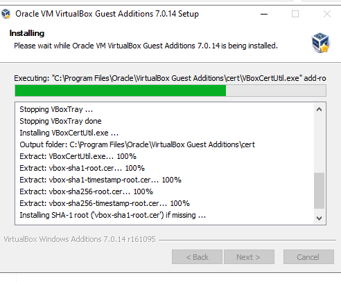

## Creación do sysprep

Sysprep W10

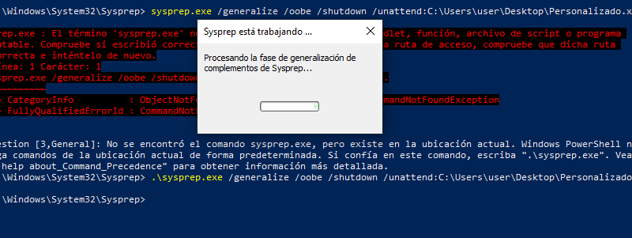

Sysprep W2022

## Clonación enlazada

Clonaciones

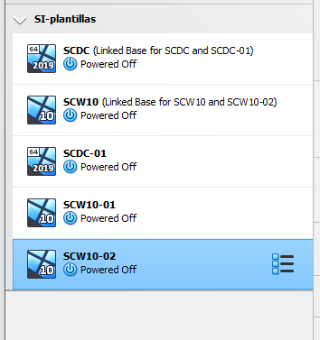

W10 funcionando

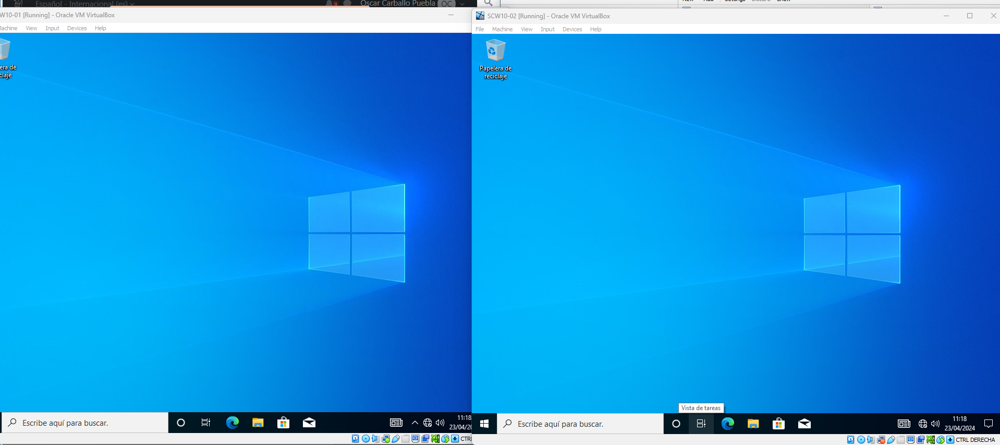

W2022 funcionando

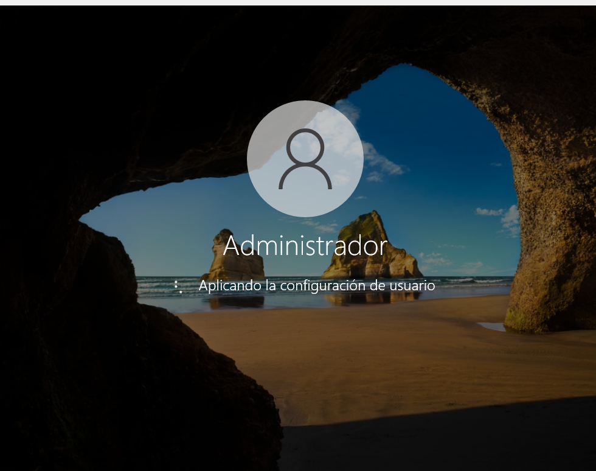

## Creación da rede

Red W2022

Red W10s

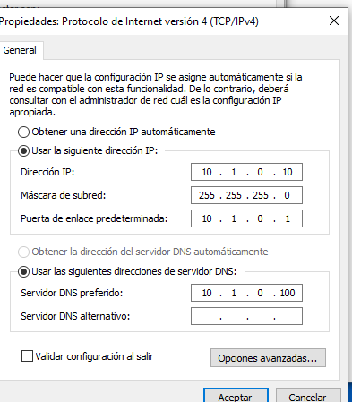

Ping desde W2022

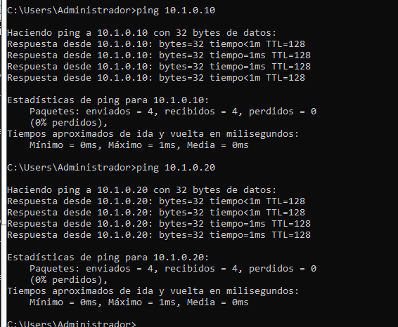

Ping desde W10

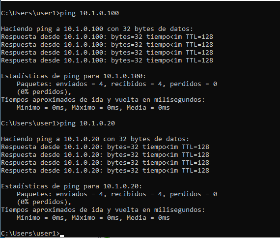
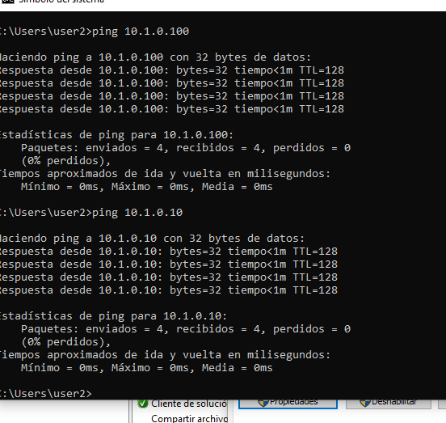
